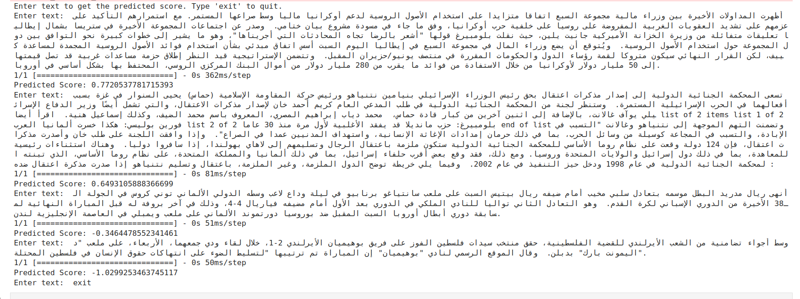
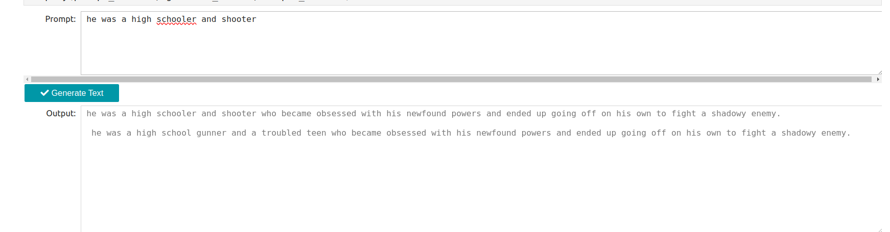
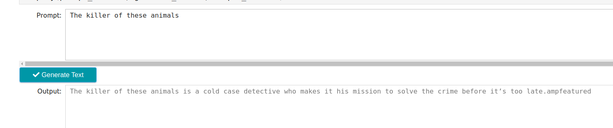
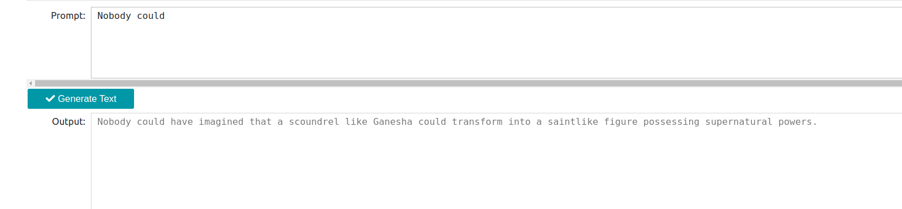

## Atelier 4:  

This repository contains three notebooks exploring NLP language models and  text generation using Pytorch library and Transformers:

**Part 1: Regression Model Evaluation**

* **Goal:** This notebook compares the performance of various Recurrent Neural Network (RNN) architectures for a regression task, specifically predicting relevance scores for Arabic news articles related to the Palestine crisis.
* **Models:** The notebook trains and evaluates the following models:
    * Simple RNN
    * Bidirectional RNN
    * GRU
    * LSTM
* **Evaluation Metrics:**
    * Mean Absolute Error (MAE)
    * Mean Squared Error (MSE)
    * R2 Score
* **Results:** The LSTM model consistently outperformed other models across all metrics, indicating its superior ability to capture temporal dependencies in the data. The GRU model also performed well, making it a viable alternative to LSTM. The Bidirectional RNN was better than Simple RNN, but still not as effective as GRU or LSTM. The Simple RNN showed the poorest performance.
* **Recommendations:**  The LSTM model is recommended for tasks requiring complex temporal understanding of sequential data. The GRU model is a strong alternative for situations where efficiency is prioritized.
* **Remarks:**  The data used for this analysis was sourced from a MongoDB database, consisting of Arabic news articles related to the Palestine crisis.  Due to limited computational resources, the models were trained on a relatively small subset of the data. This may have impacted the results and highlights the need for larger datasets and more powerful hardware for optimal model training.

**Part 2: Pytorch-Transformer (Text generation) with GPT2 Pre-trained model:**

* **Goal:** This notebook focuses on text generation using the GPT2 pre-trained model in PyTorch.
* **Dataset:** Netflix Descriptions - The notebook uses a dataset of Netflix show descriptions to train the model for generating similar descriptions.
* **Preprocessing:**  
    * Loading only the 'description' column from the dataset (limited to 1000 lines for resource efficiency).
    * Using a GPU if available for processing.
* **Model:** 
    * Loading the GPT2-medium model and its associated tokenizer from PyTorch Transformers.
    * Defining the maximum length of generated text based on the maximum length found in the dataset.
    * Training the model (commented out in the notebook, as it took 24 hours to train and a trained model is already saved).
* **Text Generation Function:** A function is defined to generate text given a prompt and several parameters for controlling the generation process. 
* **Interface:** A user interface is created using IPyWidgets to allow users to input a prompt and generate a text description.
* **Remarks:** This notebook showcases text generation using a pre-trained transformer model. The choice of GPT2-medium and the limited dataset were made to ensure efficient execution on a machine with limited resources.  

**Part 3: BERT-BASE-UNCASED**

* **Goal:** This notebook explores sentiment analysis using the BERT-BASE-UNCASED model for classifying Kindle Store Books reviews as positive or negative.
* **Dataset:** Kindle Store Reviews. 
* **Preprocessing:**
    * Loading reviews data from a .json.gz file and selecting the 'reviewText' and 'overall' columns.
    * Transforming the 'overall' rating into a binary label (positive: 1, negative: 0) by thresholding at 3 stars.
* **Model:**
    * Loading the BERT-BASE-UNCASED model and its tokenizer from Hugging Face Transformers. 
    * Using the 'bert-base-uncased' model for sentiment classification.
    * Creating a Torch dataset for efficient training and evaluation.
* **Training:**
    * The notebook defines a training loop and a custom loss function (CrossEntropyLoss). 
    * It also defines a function to calculate various metrics (accuracy, precision, recall, F1, BLEU, BERTScore) for evaluation.
* **Results:** The model achieved moderate performance, with an accuracy of approximately 71.5% on a subset of the data.
* **Recommendations:**  
    * The model's performance could be improved using a larger, balanced dataset and further hyperparameter tuning.
    * It's important to experiment with other BERT variants for potentially better performance.
* **Remarks:**  
    * The training process for BERT models is computationally intensive, and this notebook uses limited epochs and batch sizes due to resource constraints. 
    * The notebook also includes the process of saving the trained model and tokenizer for future use without retraining.

**TESTING & RESULTS:**
1. PART1 Testing LSTM Model:

2. PART2 Testing GPT2 Generator:

**Overall:**

This repository provides a hands-on introduction to sentiment analysis and text generation using pre-trained language models in Python. The notebooks illustrate the different steps involved in training, evaluating, and using these models, while highlighting the challenges and potential improvements associated with them.  
